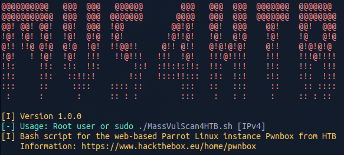
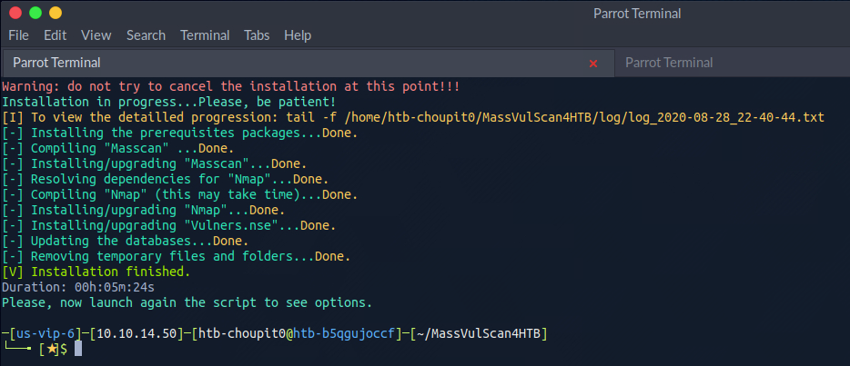
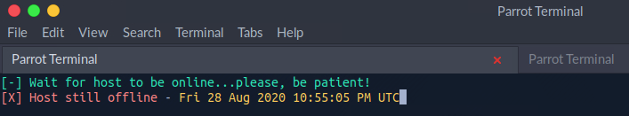
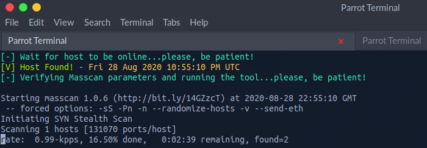
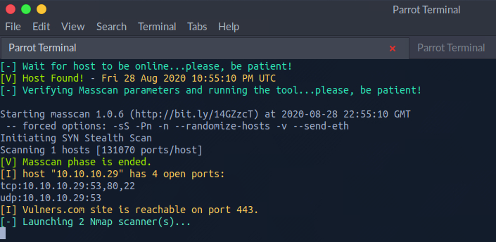
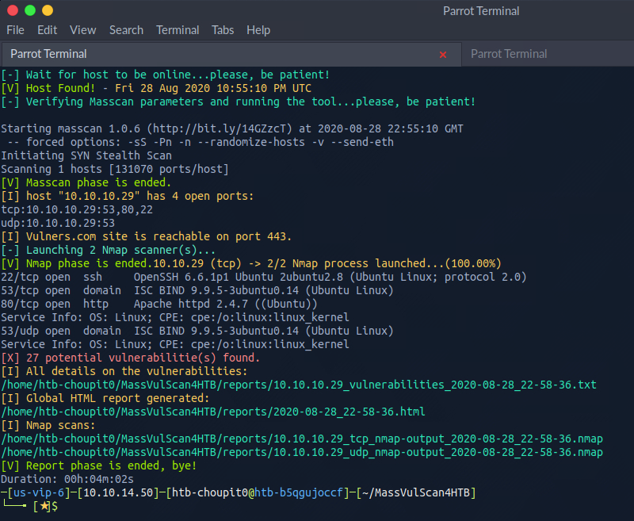
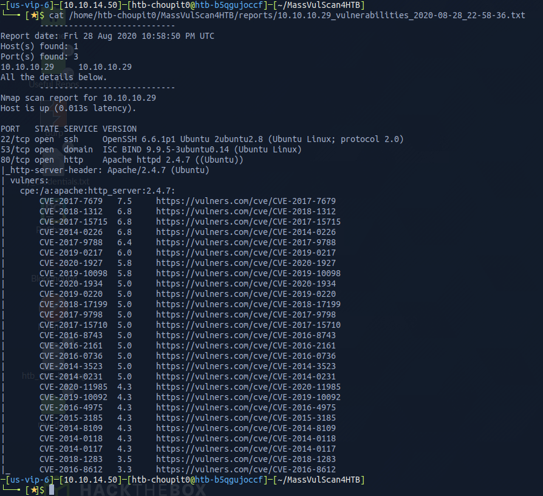
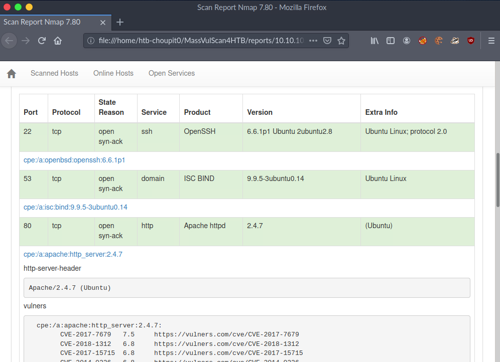

# MassVulScan4HTB :alien: [Version Francaise](https://github.com/choupit0/MassVulScan4HTB/blob/master/README-FR.md)
# Description
Bash script specially create for the HackTheBox Platform and its web-based parrot linux instance Pwnbox: https://www.hackthebox.eu/home/pwnbox

This script is a variant of the initial script MassVulScan.sh (https://github.com/choupit0/MassVulScan).

**Launch the script against an old or new machines that under testing and are scheduled to release very soon (few minutes/hours before the Go live).**



# Prerequisites
- Package xsltproc (for the conversion of an XML file to HTML, for the final report)
- Masscan, version >= 1.0.5 (https://github.com/robertdavidgraham/masscan)
- Nmap (https://nmap.org)
- NSE script vulners.nse (https://github.com/vulnersCom/nmap-vulners)

**The script will install for you all these prerequisites (~1 minute).**
# How the script works?
The main steps of the script:
1) Waiting for host to be online (unreleased machine scheduled to release very soon)
2) Once online, extremely fast identification of open TCP/UDP ports (masscan)
3) The result (file) is sorted to gather all ports to be scanned to the host
4) Identification of services and potential vulnerabilities, multiple nmap sessions (+ vulners.nse) in parallel, one per protocol (TCP/UDP)
6) Reports: a global HTML report will be created containing all the details, a TXT file to focus on services (potentially) vulnerable and standard nmap output(s)

The HTML report uses a bootstrap style sheet (https://github.com/honze-net/nmap-bootstrap-xsl) for more convenience.
# How to use it?
All you have to do is indicate the IPv4 address to scan:
```
git clone https://github.com/choupit0/MassVulScan4HTB.git
cd MassVulScan4HTB
root user or sudo ./MassVulScan4HTB.sh [IPv4]
```
**The script will scan all the TCP/UDP ports (65535 x2), the speed rate or number of packets per second is set to 1000, and NSE vulners.nse is used with Nmap.
The interface is set to "tun0", the OpenVPN interface.**

**A complete scan + reports takes ~5 minutes.**
# GIF Demo
TODO
# Some screenshots













# OS Compatibility
The script has only been tested on Debian family OS but should work on most Linux distributions (except for prerequisites installation).
# Notes / Tips
Note that the advantage of using the NSE vulners.nse script is that it systematically polls the vulners.com site database, so it will be the latest available data. Similarly, the latter performs a ranking and sorting of identified CVEs, the most severe at the top of the list, which is very convenient.
# Known issues / Limitation
Concerning SNMP, sometimes UDP port scan doesn't seems correctly working with masscan program. I'm trying to find a solution.

Outside Pwnbox context, masscan doesn't seems correctly working with the OpenVPN connection pack. No solution found.

Compatibility with IPv6 is under testing.
